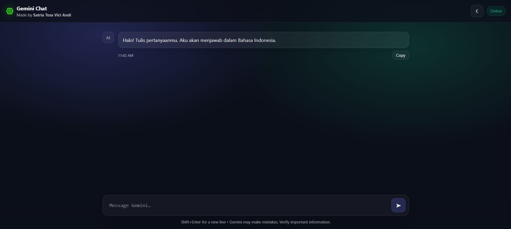
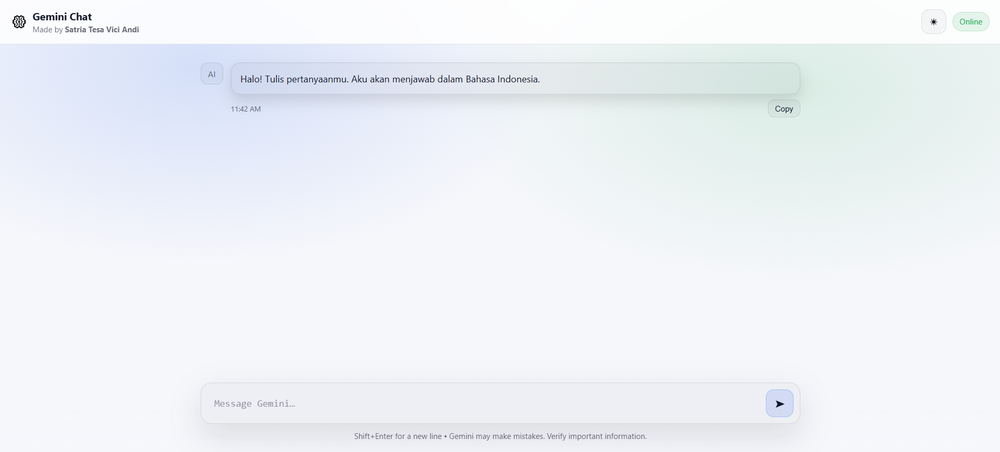
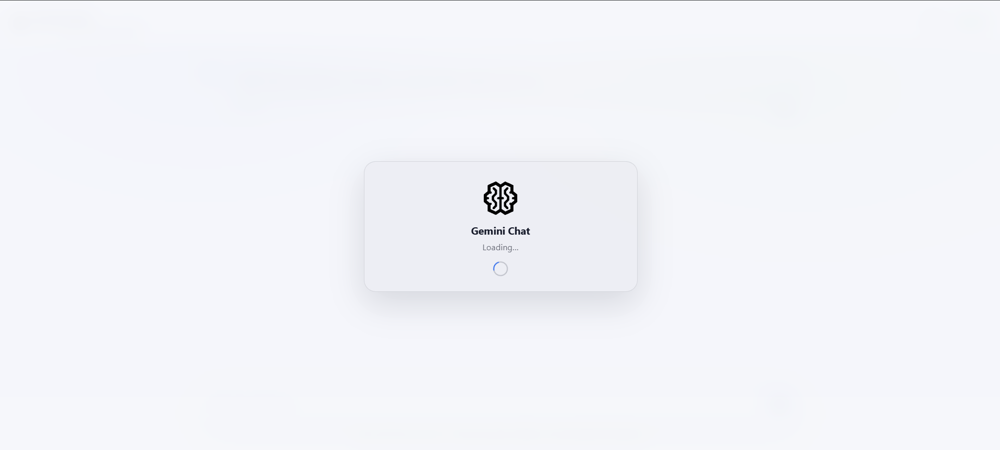
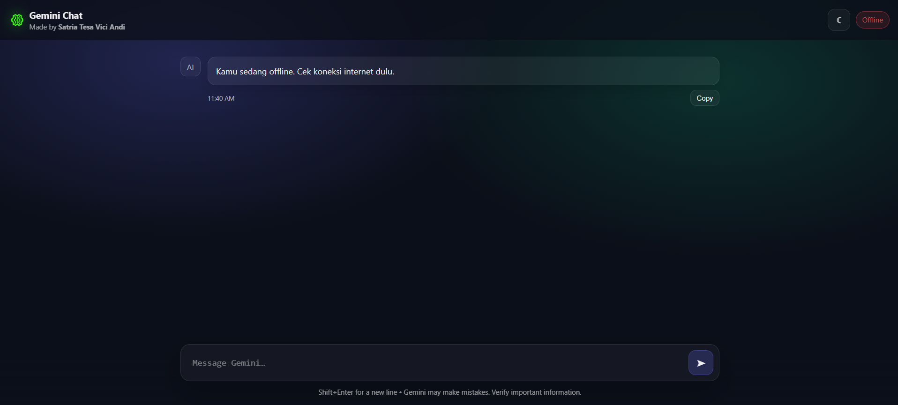

# Gemini AI Chatbot (Node.js + Express)

A modern ChatGPT-like chatbot web app powered by **Google Gemini API**, built using:

- **Node.js + Express** (Backend)
- **Vanilla JavaScript** (Frontend)
- Light/Dark Theme Toggle
- Copy-to-Clipboard + Shift+Enter Support

---

## ✨ Features

✅ Gemini AI response generation using Google GenAI SDK  
✅ Clean ChatGPT-inspired user interface  
✅ Multi-turn conversation history support  
✅ Typing indicator animation  
✅ Copy button for AI responses  
✅ Shift + Enter for new line  
✅ Enter to send message  
✅ Light/Dark Mode Toggle (saved in localStorage)  
✅ Simple and production-ready Vanilla JS code  

---

## 📸 Preview

### 1. Dark Mode / Light Mode

| Dark Mode | Light Mode |
|----------|------------|
|  |  |

---

### 2. Initial / Reload Loading Animation

| Loading (Dark Mode) | Loading (Light Mode) |
|---------------------|----------------------|
|  |  |

---

### 3. Network Status Indicator

| Online Status | Offline Status |
|--------------|---------------|
|  |  |

---

## 📂 Project Structure

```bash
gemini-chatbot/
│
├── index.js              # Express backend + Gemini API integration
├── .env                  # API key configuration
├── package.json
│
└── public/
    ├── index.html        # Frontend UI layout
    ├── style.css         # ChatGPT-like styling + themes
    ├── script.js         # Chat logic + formatting + UX features
    └── assets/           # Icons + preview screenshots

```
---

## ⚙️ Requirements
- Node.js v18+ recommended
- Google Gemini API Key

---

## 🚀 Setup & Installation
### 1. Clone Repository
```bash
git clone https://github.com/satriatva/gemini-ai-sesi-5.git
cd gemini-ai-sesi-5

```

### 2. Install Dependencies'
```bash
npm install
```

### 3. Create .env File
Inside the root folder, create:
```env
GEMINI_API_KEY=YOUR_API_KEY_HERE
```

### 4. Run the Server
```bash
node index.js
```

### 5. Open in Browser
http://localhost:3000

---

## 👤 Author
Developed by:

**Satria Tesa Vici Andi**
📍 Jakarta, Indonesia


